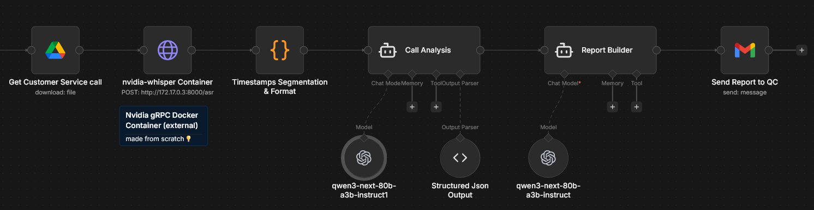
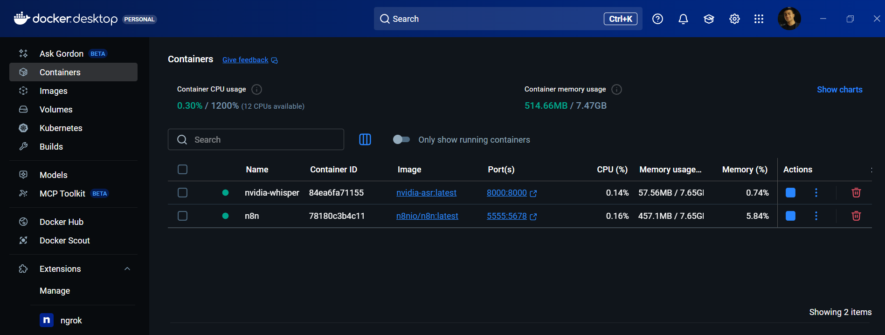
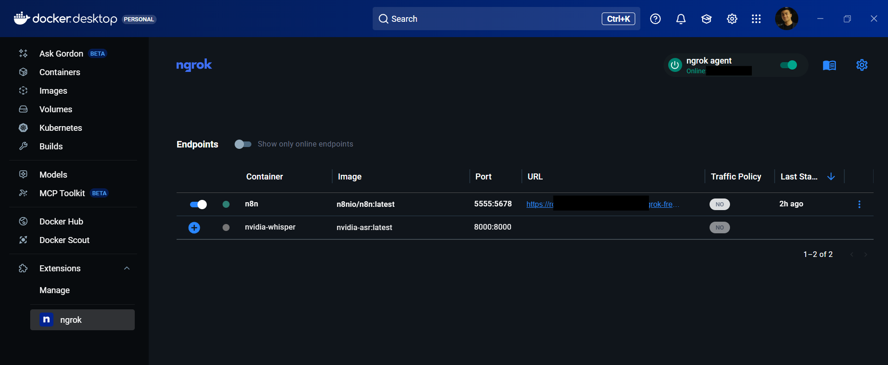

# TraceCall-ai (English & Arabic)

This project automates customer support call quality analysis by converting call recordings into fully structured QA reports.

It is designed for QA teams, compliance teams, contact centers, and operations leaders who need scalable, consistent, and auditable call reviews.

#### **Transforming raw calls --> Actionable operational insights.**

## Architecture & Workflow

#### Key Design Principles

- Modular & containerized

- Model-agnostic **(ASR & LLMs)**

- Evidence-based (timestamps for every claim)
  

## Key Capabilities

- 🎙 High-accuracy ASR using **NVIDIA Whisper** (🐋 Docker container built from Scratch)
  - **Input:** .Wav files,
  - **Output:** .Json response
  - **API:** FASTAPI

- ⏱ Precise timestamp segmentation (30s timestamps).

- Deep conversational analysis using **qwen3-next-80b-a3b-instruct: Ultra-long-context**.

- 📊 Agent performance scoring (0->10).

- 😊 Customer sentiment & satisfaction prediction.

- ⚠️ Compliance & operational risk detection.

- 🧾 Audit-ready structured JSON - split information to different teams depending on interest.

- 📝 Executive-ready narrative reports.

- 📧 Automated email delivery to QC teams using **Gmail API**.

---

### 🎧 Sample Customer Support Call

A real **11:30 mins** customer support call recording used to generate the example QA report:

▶️ **[Customer_Support_Call_1.wav](Sample_Calls/Technical_support_Sample_Call.wav)**

### Sample AI-Generated Call Report

📄 **[Call_Report.pdf](Sample_reports/Sample_Report.pdf)**
